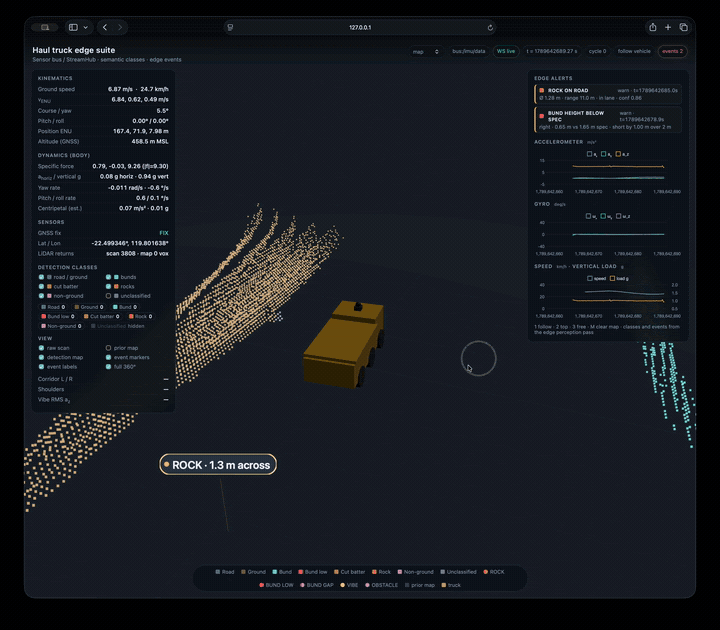

# Haul Edge Simulator

A synthetic haul-truck sensor and edge-perception stack built with Python and ROS 2.
It generates synchronized LiDAR, IMU, GNSS, and odometry streams across realistic
haul-road terrain, detects operational hazards, and presents the results in a live
3D browser interface.

[](https://github.com/nilushan/haul-edge-simulator/actions/workflows/ci.yml)


<p align="center">
  
</p>

<p align="center"><em>Live synthetic LiDAR perception, hazard detection, vehicle telemetry, and edge alerts.</em></p>

## Highlights

- **Deterministic sensor simulation** for LiDAR, IMU, GNSS, and vehicle odometry.
- **Four synthetic haul-road scenarios** with grades, switchbacks, cut batters,
  safety berms, missing berm sections, and rock hazards.
- **Shared perception library** for ground segmentation, semantic labeling, rock
  detection, berm compliance checks, vibration monitoring, and event deduplication.
- **ROS 2 edge architecture** with small, independently testable nodes connected by
  a stable topic contract.
- **Live 3D visualization** using Three.js, Chart.js, REST, and WebSockets.
- **Replayable JSONL streams** for repeatable development and regression testing.
- **Local event persistence** in SQLite for disconnected edge operation.

## Demo architecture

```text
Synthetic sensors / recorded streams
                 │
                 ▼
       ROS 2 sensor topic bus
       /imu  /gnss  /lidar  /odom
                 │
       ┌─────────┼──────────┬───────────────┐
       ▼         ▼          ▼               ▼
  rock detect  berm detect  vibration   web visualizer
       │         │          │               │
       └─────────┴──────────┴─► alerts       ▼
                              SQLite    live 3D browser
```

The core simulation and perception packages do not require a running ROS daemon.
ROS nodes are deliberately thin adapters around those libraries.

## Quick start

### Docker (recommended)

Requirements: Docker with Compose v2.

```bash
./start.sh
```

Open <http://127.0.0.1:8099/> to explore the live simulation.

Run the complete ROS 2 edge stack:

```bash
./start.sh --edge
```

### Local Python

Requirements: Python 3.10 or newer.

```bash
python3 -m venv .venv
source .venv/bin/activate
python -m pip install -r requirements.txt
./scripts/run_viz.sh
```

### Available modes

| Command | Mode |
|---|---|
| `./start.sh` | In-process simulator, perception, and browser UI |
| `./start.sh --edge` | Full ROS 2 stack with detectors, storage, and UI |
| `./start.sh --ros` | ROS 2 sensor publisher only |
| `./start.sh --replay` | Replay generated sensor streams |
| `./start.sh --shell` | Interactive ROS 2 Jazzy container |

Use `./start.sh --help` for map, port, and duration options.

## Detection output

Each LiDAR frame is assigned one of the shared semantic classes: `road`, `ground`,
`bund`, `bund_low`, `cut_slope`, `rock`, `obstacle`, or `unknown`. Actionable
findings are emitted as structured events:

| Event | Example output |
|---|---|
| Rock hazard | Size, range, lateral offset, and in-lane state |
| Low berm | Measured height, required height, deficit, length, and side |
| Berm gap | Observed gap length and side |
| Excessive vibration | RMS acceleration, peak acceleration, and vehicle speed |

A single style catalog drives semantic colors, map markers, filters, and event
labels so the perception output and browser presentation remain consistent.
See [`docs/EDGE_ARCHITECTURE.md`](docs/EDGE_ARCHITECTURE.md) for detector behavior
and measurement constraints.

## Project structure

```text
ws/src/
├── libs/
│   ├── edge_sim/          # maps, vehicle and sensor models, stream I/O
│   └── edge_perception/   # perception algorithms and shared schemas
├── nodes/
│   ├── edge_sensor_source/
│   ├── edge_rock_detect/
│   ├── edge_bund_detect/
│   ├── edge_vibe_detect/
│   ├── edge_event_store/
│   ├── edge_processor/
│   └── edge_viz/
└── bringup/
    └── edge_bringup/      # launch files and shared configuration
```

More detail is available in [`docs/STRUCTURE.md`](docs/STRUCTURE.md).

## Testing

The test suite covers sensor models, terrain generation, stream recording and
replay, perception algorithms, event storage, node helpers, and visualization APIs.

```bash
python -m pip install -r requirements.txt pytest
source scripts/env_pythonpath.sh
python -m pytest ws/src/libs ws/src/nodes -q
```

## Generate replay data

Generated streams are intentionally excluded from Git.

```bash
./scripts/generate_streams.sh
STREAM_MODE=replay ./scripts/run_viz.sh
```

## Scope

This project is a development and demonstration simulator. Its synthetic data and
hazard detections are not validated for safety-critical vehicle operation.
Planned improvements are tracked in [`docs/ROADMAP.md`](docs/ROADMAP.md).

## Development process

The architecture, functionality, domain modeling, and technical direction were
designed and guided by Nilushan Silva. AI-assisted development tools were used
during implementation, testing, and documentation; final decisions and review
remained human-directed.

## License

Licensed under the [Apache License 2.0](LICENSE). Vendored browser dependencies
retain their original MIT licenses; see [THIRD_PARTY_NOTICES.md](THIRD_PARTY_NOTICES.md).
